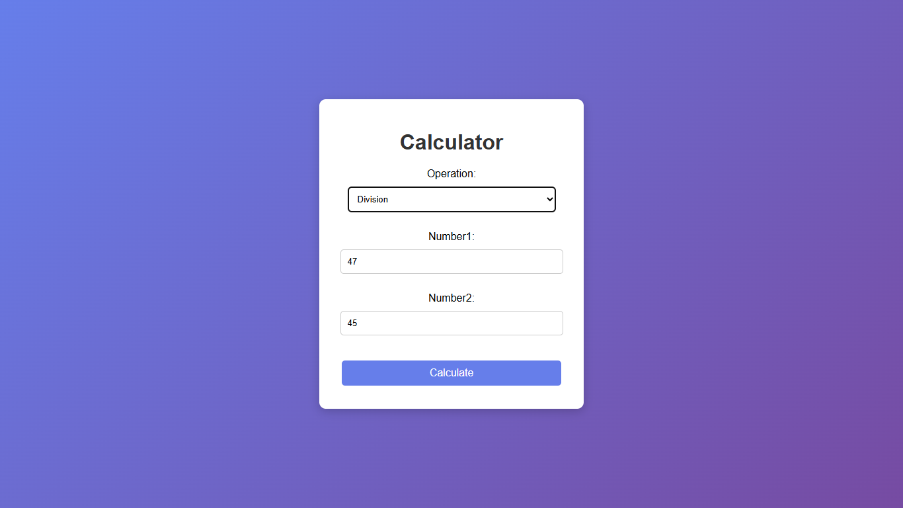
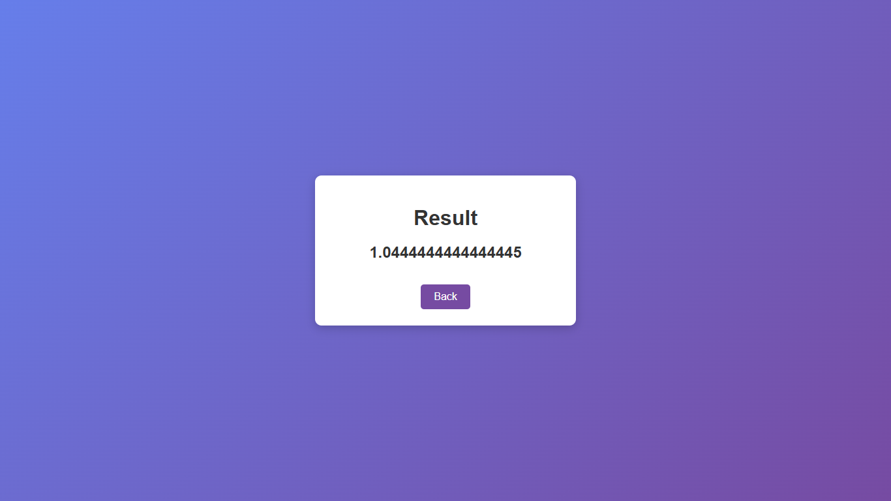
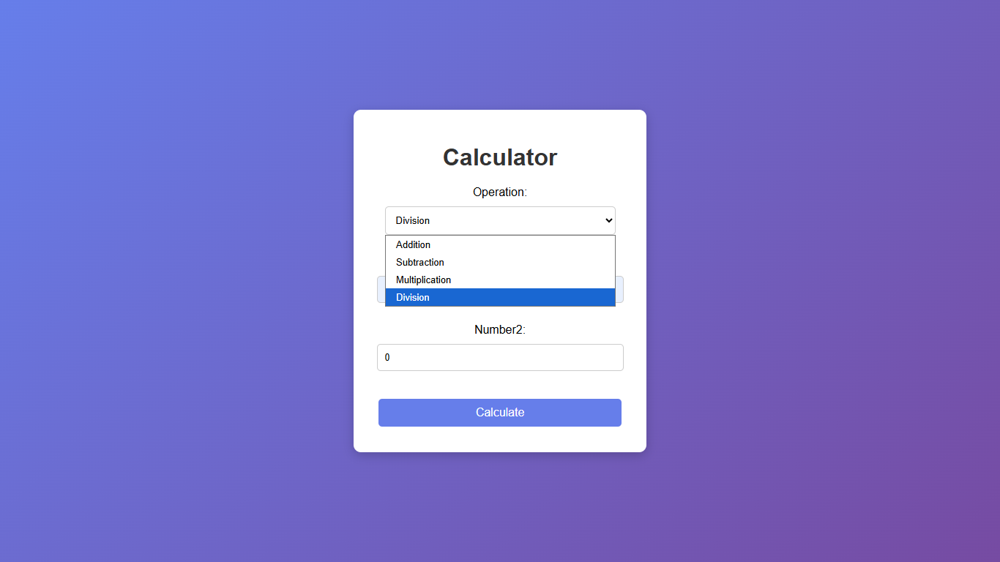
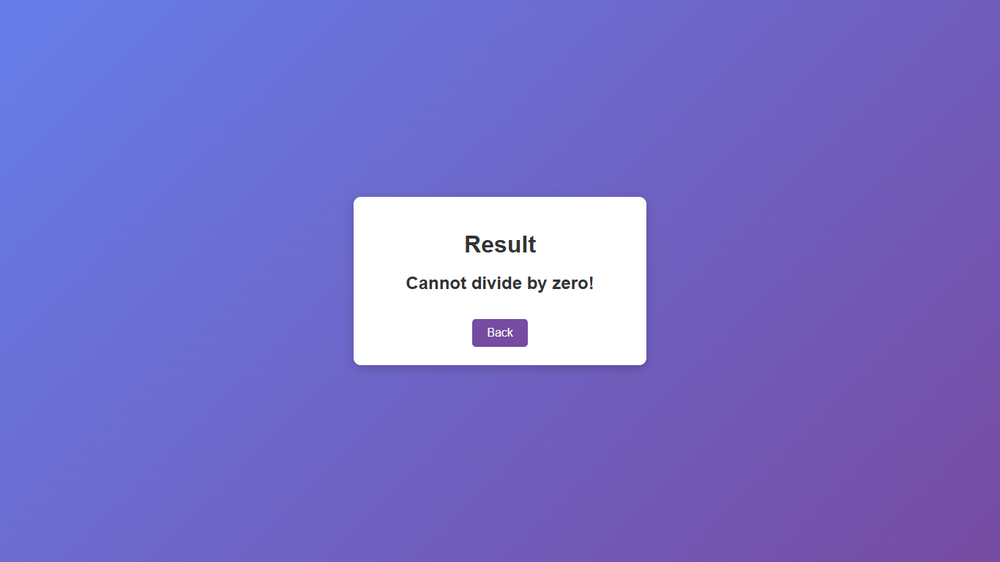

# 🔢 Online Calculator using Spring MVC (Non-Boot)


A simple web-based calculator built using the **Spring MVC framework without Spring Boot**. This project demonstrates the fundamentals of the Spring MVC architecture by manually configuring the application using XML, making it ideal for understanding the request lifecycle and MVC workflow.

---

## ✨ Features

- Perform basic arithmetic operations:
  - Addition
  - Subtraction
  - Multiplication
  - Division
- Handles division by zero gracefully
- Clean and responsive JSP-based user interface
- Navigation between input and result pages
- Manual Spring MVC configuration without Spring Boot

---

## 🛠️ Tech Stack

| Category | Technology |
|----------|------------|
| Language | Java 17 |
| Framework | Spring MVC 5.x |
| View Technology | JSP |
| Build Tool | Maven |
| Web Server | Apache Tomcat |
| Styling | CSS3 |

---

## 📁 Project Structure

```text
OnlineCalculator-Using-SpringMVC/
├── src/
│   └── main/
│       ├── java/
│       │   └── com.Cal3/
│       │       └── CalcController.java
│       └── webapp/
│           ├── WEB-INF/
│           │   ├── web.xml
│           │   ├── spring-servlet.xml
│           │   └── views/
│           │       ├── Calculator3.jsp
│           │       └── result.jsp
│           └── resources/
│               └── css/
│                   └── style.css
├── pom.xml
└── README.md
```

---

## 🔄 Spring MVC Request Flow

```text
Browser
   │
   ▼
DispatcherServlet
   │
   ▼
Controller
   │
   ▼
Model
   │
   ▼
ViewResolver
   │
   ▼
JSP View
```

---

## 🧠 Concepts Demonstrated

- Manual configuration using `web.xml`
- Configuring `DispatcherServlet`
- Spring MVC request mapping with `@Controller`
- `@GetMapping` and `@PostMapping`
- Passing data using the `Model`
- View resolution with `InternalResourceViewResolver`
- JSP-based view rendering
- WAR deployment on Apache Tomcat
- Context path handling in servlet applications

---

## ⚙️ Getting Started

### Prerequisites

- Java 17
- Maven
- Apache Tomcat 9 or later

### Clone the Repository

```bash
git clone https://github.com/Atharva-Shelke/OnlineCalculator-Using-SpringMVC.git
```

### Build the Project

```bash
mvn clean package
```

A WAR file will be generated in the `target` directory.

### Deploy to Tomcat

Copy the generated WAR file:

```text
target/OnlineCalculator.war
```

to your Tomcat `webapps/` directory.

Start the Tomcat server and open:

```text
http://localhost:8080/OnlineCalculator/
```

---

## 📸 Screenshots

### Calculator Page



### Result Page



### Calculator Page



### Result Page



---

## 📚 What I Learned

- Spring MVC architecture and request lifecycle
- Manual XML-based Spring configuration
- DispatcherServlet configuration
- Controller and view communication
- JSP rendering with View Resolver
- WAR packaging and deployment on Apache Tomcat
